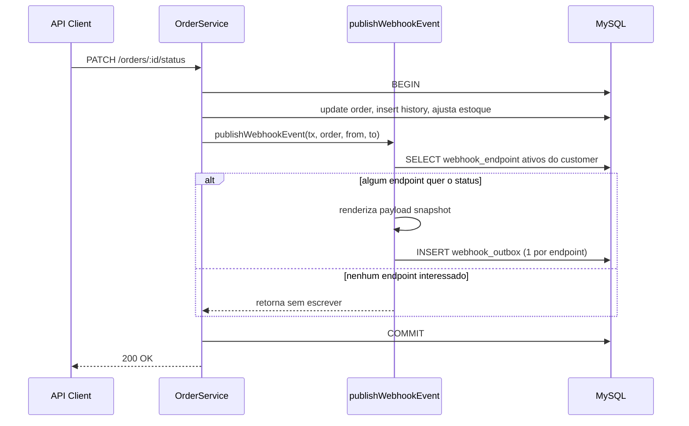
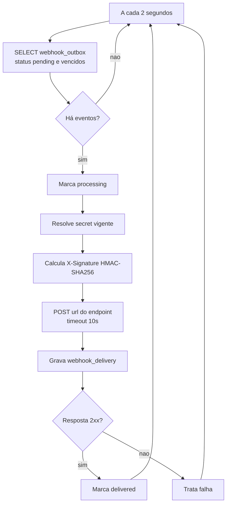
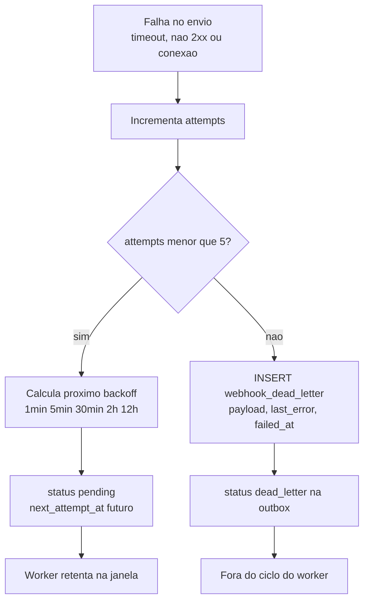
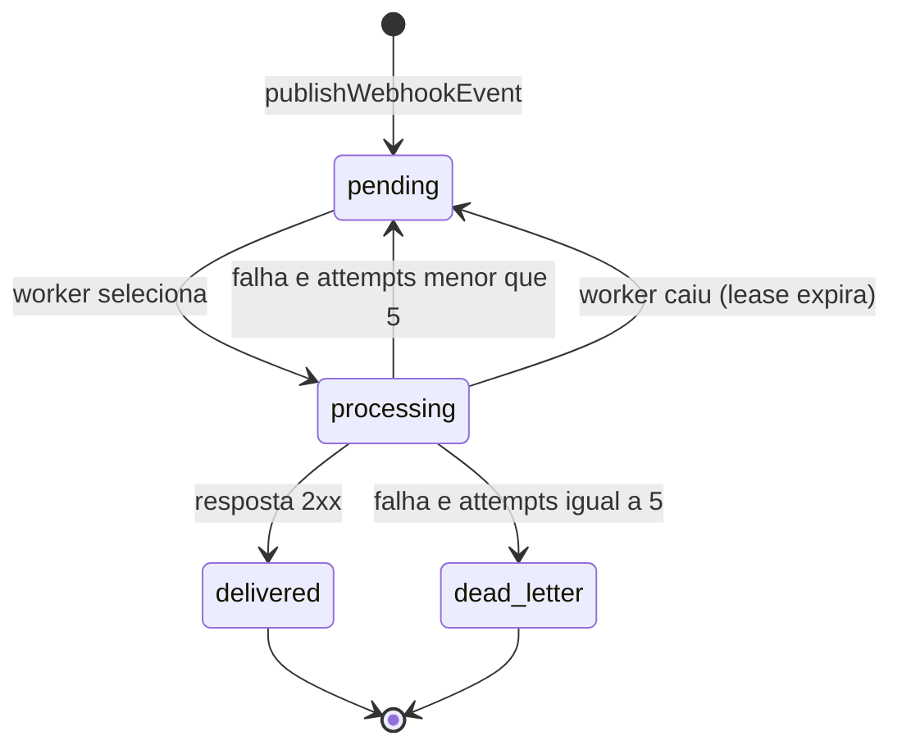
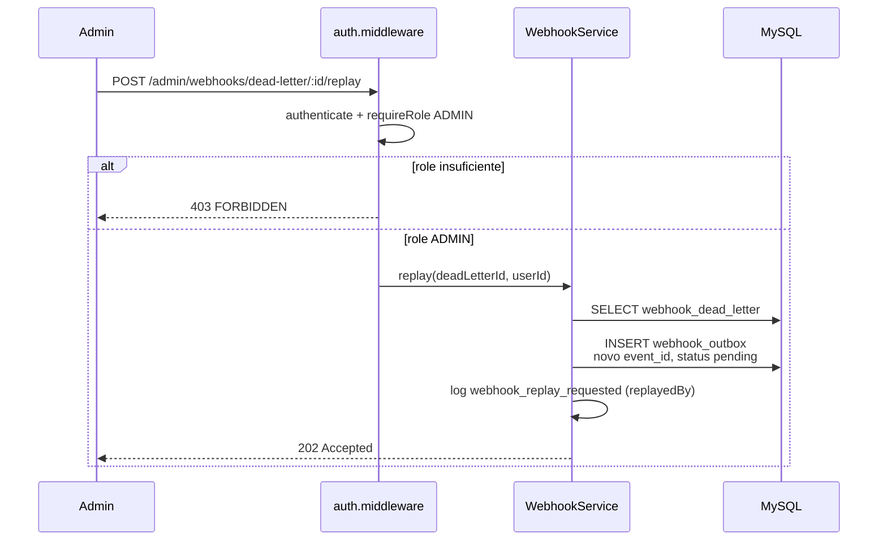
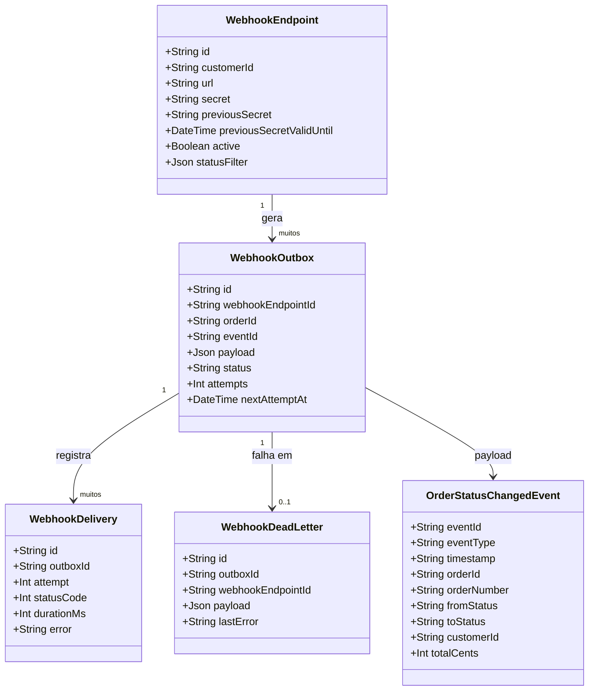

# Diagramas: Sistema de Webhooks de Notificação de Pedidos

Diagramas de apoio ao [FDD](../FDD.md). Texto em português; nomes técnicos em inglês.

## Visão Geral

A feature entrega notificações outbound quando o status de um pedido muda. Um evento é
gravado numa tabela outbox dentro da transação de `changeStatus`; um worker em processo
separado faz polling a cada 2 segundos e entrega o evento por HTTP, assinado com
HMAC-SHA256, com retry, backoff e dead letter queue.

## Elementos Identificados

### Fluxos externos
- Cliente da API muda o status de um pedido via `PATCH /api/v1/orders/:id/status`
- Worker faz `POST` HTTP para a `url` do endpoint do cliente
- Administrador dispara replay de item da DLQ

### Processos internos
- `publishWebhookEvent(tx, order, fromStatus, toStatus)` dentro da transação
- Filtro de status de interesse na inserção da outbox
- Loop de polling do worker (2 s)
- Cálculo do `X-Signature` (HMAC-SHA256)
- Retry com backoff `1min / 5min / 30min / 2h / 12h`
- Movimentação para `webhook_dead_letter` após 5 falhas

### Variações de comportamento
- Nenhum endpoint interessado no status: evento não é inserido
- Resposta 2xx do cliente: evento marcado `delivered`
- Falha ou timeout: retry enquanto `attempts < 5`, senão DLQ
- Secret dentro do grace period: duas secrets válidas para verificação

### Contratos públicos
- Endpoints de configuração de webhook (CRUD, rotação de secret, deliveries)
- Endpoint administrativo de replay
- Payload e headers do webhook enviado ao cliente

## Diagramas

### Publicação do evento na transação de mudança de status

Mostra o caminho feliz da criação do evento. A chamada de `PATCH /orders/:id/status` entra
em `OrderService.changeStatus`, que já roda uma transação; a novidade é a chamada a
`publishWebhookEvent` ainda dentro do mesmo `tx`, que consulta os endpoints interessados e
insere uma linha por endpoint na outbox. É o diagrama central para entender a garantia de
atomicidade entre a mudança de status e o registro do evento.

**Notas:**
- Se qualquer `INSERT` da outbox falhar, `publishWebhookEvent` lança e o `COMMIT` vira `ROLLBACK`.
- O payload é renderizado uma vez e reaproveitado para todos os endpoints do customer.
- Nenhuma chamada de rede acontece dentro da transação.

### Loop de processamento do worker

Detalha o ciclo do worker a cada 2 segundos: seleção dos pendentes, cálculo da assinatura,
envio HTTP com timeout e registro da tentativa. Esclarece o que não é óbvio a partir da
API: o worker é um processo separado que só lê e escreve o banco, e a decisão de sucesso
depende só do código de resposta do cliente.

**Notas:**
- A seleção ordena por `created_at` ascendente, o que garante ordem por `order_id` com worker único.
- `webhook_delivery` guarda `attempt`, `status_code`, `duration_ms` e `error` de cada tentativa.
- Durante o grace period de rotação, a secret anterior também é aceita na verificação do cliente.

### Decisão de retry, backoff e DLQ

Foca na parte mais difícil do fluxo: o que acontece quando um envio falha. Mostra o
incremento do contador de tentativas, o agendamento da próxima tentativa pelo array de
backoff e a passagem para a dead letter queue no limite. É a referência para implementar a
resiliência descrita no FDD.

**Notas:**
- O agendamento é persistido em `next_attempt_at`, não em timer de memória: um restart do worker não perde retries.
- São exatamente 5 tentativas; a 5ª falha move o evento para a DLQ.
- O evento fica na `webhook_outbox` como histórico, marcado `dead_letter`, mas não é mais selecionado.

### Estados de um evento na outbox

Diagrama de estados da linha de `webhook_outbox` ao longo da vida. Ajuda a validar as
transições possíveis e garante que `delivered` e `dead_letter` são terminais.

**Notas:**
- A transição `processing -> pending` por lease expirado é o que garante at-least-once quando o worker cai após enviar.
- `delivered` e `dead_letter` são terminais para aquela linha.
- Um replay de DLQ cria uma linha **nova** em `pending`, com novo `event_id`.

### Replay de item da dead letter queue

Mostra o fluxo administrativo: o endpoint exige role ADMIN, cria um novo evento na outbox a
partir do payload guardado e registra quem executou. Esclarece que o replay não reusa a
linha antiga.

**Notas:**
- O `replayedBy` vem de `req.user.id`, para auditoria.
- Um segundo replay do mesmo item enquanto há evento pendente originado dele retorna `WEBHOOK_ALREADY_REPLAYED` (409).

### Contratos públicos do módulo

Diagrama de classes das entidades e do payload de saída, para quem vai integrar. Mostra a
relação entre `webhook_endpoint`, `webhook_outbox`, `webhook_delivery` e
`webhook_dead_letter` e o formato do evento entregue.

**Notas:**
- `id` de `WebhookOutbox` é o mesmo valor de `eventId` e vai no header `X-Event-Id`.
- `statusFilter` é uma lista de valores do enum `OrderStatus`.
- `OrderStatusChangedEvent` não inclui os itens do pedido; o cliente consulta `GET /orders/:id` se precisar de detalhe.
